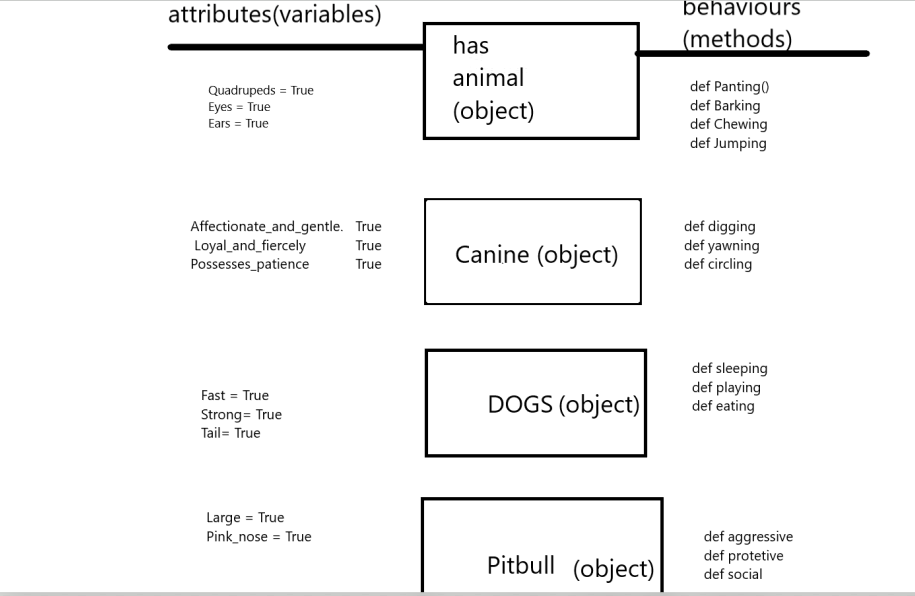

# OOP Four Pillars

- Abstraction
- Encapsulation
- Inheritance
- Polymorphism


# What is OOP?

Object-oriented programming (OOP) is a programming paradigm based on the concept of "objects", which can contain data and code that manipulates the data. It's designed to encapsulate code into reusable and modular units, called classes, and objects, instances of classes.

The main principles of OOP are:

- Encapsulation: objects hide their internal state from the outside world and only expose a well-defined interface for accessing and manipulating it.
- Abstraction: objects provide a high-level view of their behavior and hide the implementation details.
- Inheritance: objects can inherit characteristics from a parent object, creating a hierarchy of objects that can be reused and extended.
- Polymorphism: objects can be treated as objects of their parent class, allowing for code to be written that can operate on objects of different classes in a uniform manner.

OOP is widely used in many programming languages, including Java, Python, C++, and others.


Now let's have a look at some examples of the `Four Pillars`.

## Abstraction:

```` python
class Animal:

    def __init__(self):
        self.alive = True
        self.spine = True
        self.eyes = True
        self.lungs = True


    def breathe(self):
        print("One breath in one breath out")

    def eat(self):
        print("nom nom nom")

    def procreate(self):
        print("find a mate")

    def move(self):
        print("onwards and upwards ")

cat = Animal()
cat.breathe()
````
The code defines a class named `Animal` that acts as a blueprint for creating objects that represent animals.

The` __init__ `method is a special method that is called when an object is created from the class, and it is used to initialize the object's state. In this case, it creates four instance variables (`alive`, `spine`, `eyes`, and `lungs`) and sets them to `True`.

The `breathe`, `eat`, `procreate`, and move methods are operations that an `animal` can perform, and they are defined in the `Animal class`. They print some text when called, which represents the behavior of the animal.

At the end of the code, an object of the `Animal` class is created and stored in a variable named `cat`. The breathe method is then called on the cat object. When the `breathe` method is called, the text "One breath in one breath out" will be printed to the console.

## Inheritance:
`````` python
from snake import Snake

class Python(Snake):

    def __init__(self):
        super().__init__()
        self.large = True
        self.two_lungs = True
        self.venom = False


    def digest_larg_prey(self):
        print("ok let me get the stretchy pants")

    def constrict(self):
        print("squeeeeeeeze")

    def shed_skin(self):
        print("im growing out of this now ")

peter  = Python()
peter.breathe()
peter.use_tongue_to_smell()
peter.hunt()
peter.shed_skin()
``````
This code demonstrates inheritance in object-oriented programming in Python, where a class named `Python` inherits properties and methods from a class named `Snake`. The Python class initializes the object by calling the `Snake` `class' __init__` method using the `super()` function and adds additional instance variables and methods specific to `Python` objects. An object of the `Python` class is created and several methods are called on it, including methods inherited from the `Snake` class and methods specific to the `Python` class.


## Encapsulation:
`````` python
from animal import Animal

class Repile(Animal):

    def __init__(self):
        super().__init__()
        self.cold_blooded = True
        self.tetrapod = None
        self.heart_chambers = [3, 4]
        self.amnioic_eggs = None


    def seek_heat(self):
        print("its chilly outside, wheres the sun?")

    def hunt(self):
        print("wait, wait,wait")

    def use_venom(self):
        print("if you have it use it")

    def attract_trough_scent(self):
        print("time to spray perfume")

jeremy_the_reptile = Repile()
``````

The code demonstrates encapsulation in object-oriented programming by implementing it within the `Reptile` class, which inherits from the `Animal` class. Encapsulation allows data and behavior to be bundled together within an object, hiding the implementation details from the outside world and exposing a well-defined interface. In the `Reptile class`, the instance variables and methods are encapsulated within the class, defining the behavior and characteristics of a reptile. An object of the Reptile class is created, encapsulating the data and behavior of a reptile within the object and exposing a well-defined interface for interaction.

## Polymorphism:

```````` python
from  reptile import Repile

class Snake(Repile):
    def __init__(self):
        super().__init__()
        self.forked_tongue = True
        self.cold_blooded = True
        self.venom = None
        self.limbs = False


    def use_tongue_to_smell(self):
        print("do i say it smells or tastes nicee?")

sidney = Snake()
sidney.seek_heat()
````````

This code demonstrates polymorphism in OOP by using inheritance. The Snake class inherits from the `Reptile class`, allowing objects of the `Snake` class to be treated as objects of the `Reptile` class. This allows methods from the superclass to be invoked on objects of the subclass, using the same method name. This ability to treat objects of different classes as objects of a common class is known as polymorphism.




## What are the benifits of OOP?

Object-Oriented Programming (OOP) offers several benefits over other programming paradigms, including:

- Abstraction: OOP allows the creation of objects that represent abstract concepts and hide the implementation details, making the code more readable and maintainable.

- Encapsulation: OOP provides a way to organize code into self-contained objects that protect their data and behavior, making the code more modular and less prone to errors.

-  Reusability: OOP promotes the reuse of code by allowing objects to be easily combined and reused in different parts of a program.

-   Polymorphism: OOP enables objects to be treated as a general type of object, allowing a single function or method to be used on objects of different types.

- Modularity: OOP allows programs to be broken down into smaller, self-contained components that are easier to develop, test, and maintain.

These benefits can lead to more efficient and effective software development, improved code readability, and easier maintenance and expansion of code over time.

